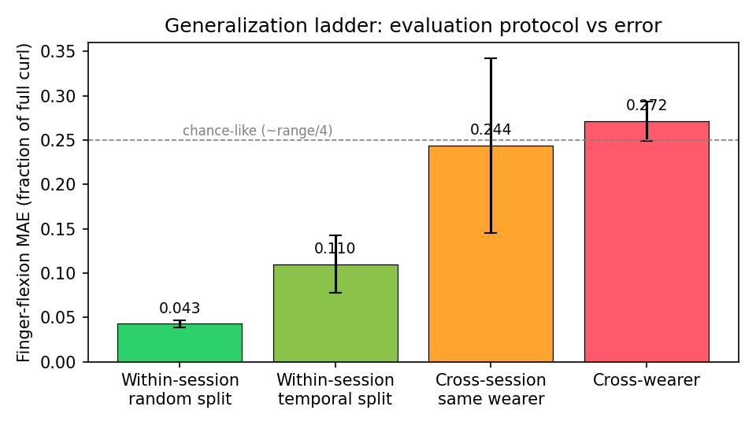
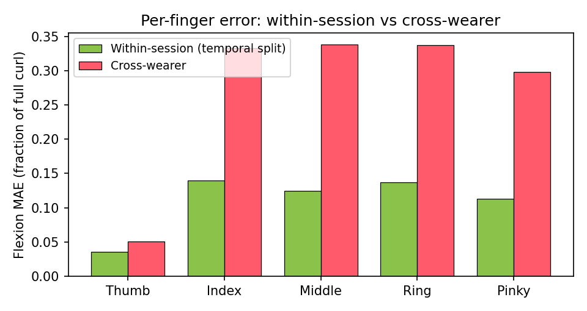

# OpenMuscle: Forearm Force-Myography with VR Hand-Tracking Ground Truth — Dataset and Honest Baselines

**Authors:** Tory (TURFPTAx) et al. — DRAFT v0.1, 2026-07-03
**Artifacts:** open hardware (FlexGrid V4), open-source pipeline (OpenMuscle-Software), dataset + this analysis (`analysis/paper/`)

## Abstract

Decoding finger motion from the forearm without cameras or gloves would unlock
practical prosthetics, teleoperation, and low-cost VR input. We present
OpenMuscle, an end-to-end open system that pairs low-cost 60-cell forearm
force-myography (FMG) bracelets with consumer VR hand tracking (Meta Quest 3S)
as an automatic ground-truth labeler, and a first two-wearer dataset of
~22,000 paired sensor-label frames collected with it. Using a deliberately
simple per-frame random-forest baseline predicting 15 wrist-relative finger
DOFs per hand, we quantify a *generalization ladder* that we argue any
wearable-sensing evaluation should report: the same model family scores a
finger-flexion MAE of 0.043 (fraction of full curl; ~4.9 deg per joint) under
the common random train/test split, 0.110 under a temporal split of the same
sessions, 0.16-0.33 when the band is re-donned in a new session, and 0.27
across wearers. Two conclusions follow. First, random splits overstate
within-session skill by ~2.6x through adjacent-frame leakage. Second, and more
consequential for the field: donning variance rivals wearer identity as the
dominant obstacle — a model tested five days later on the *same* wearer
degraded as much as one tested on a *different* wearer. We release the
hardware, dataset, capture pipeline (with per-session provenance and live
data-quality verdicts), and all analysis code.

## 1. Introduction

Hand pose is the highest-bandwidth human output channel, yet capturing it
outside the lab still requires cameras with line-of-sight or instrumented
gloves. Forearm-mounted sensing — surface EMG or, as here, force myography
(FMG: pressure distribution over the forearm surface produced by muscle and
tendon displacement) — promises an unobtrusive alternative, but the field has
two chronic problems: ground-truth labels are expensive, and reported accuracy
often fails to survive a change of session or user.

OpenMuscle attacks both. For labels, we exploit the hand-tracking stack that
ships in consumer VR headsets: a wearer simply moves their hands while a Quest
3S streams 25-joint poses (~25 Hz) into the same clock domain as the bracelet
data, producing labeled data at zero marginal annotation cost. For honesty, we
report every result under four splits of increasing difficulty and release the
pipeline that enforces provenance (per-session wearer/device/firmware
stamping) and live capture-quality verdicts, so future datasets are clean by
construction.

Contributions: (1) an open FMG-plus-VR-labeling system (hardware, firmware,
capture studio); (2) a first two-wearer, four-session dataset with
wrist-relative canonical finger-angle labels; (3) baselines under a four-rung
generalization ladder, quantifying split leakage (~2.6x), donning variance,
and wearer specificity; (4) tooling lessons (silent model-routing failures,
flat-cell duds) encoded as guards in the released pipeline.

## 2. System

**Bracelet.** FlexGrid V4: a 15x4 grid of force-sensitive cells (60 channels,
~12-bit, 18-20 Hz over Wi-Fi UDP) plus a 6-axis IMU, worn on the forearm. Two
bracelets (one per forearm) stream simultaneously to a PC hub. Firmware,
schematics, and the communication protocol are open.

**Labels.** A WebXR application on a Meta Quest 3S streams both hands' 25-joint
poses (position + orientation, 7 floats/joint = 175 values) to the hub, where a
temporal matcher pairs each sensor frame with the nearest label frame within a
175 ms window, timestamped on the single hub clock. Each band is routed to the
hand on its own arm (left band <-> left hand).

**Canonical targets.** Raw joint positions are world-frame and therefore
unusable for cross-session comparison (a model would memorize where the wearer
stood). All experiments here regress 15 wrist-relative angular DOFs per hand,
derived deterministically from the raw joints: per-finger flexion normalized
to [0,1] (5 targets; 0 = extended, 1 = curled) and per-joint flexion angles in
degrees for MCP+PIP of each finger and MCP+IP of the thumb (10 targets). The
released pipeline writes these canonical labels at capture time; for this
paper they are re-derived uniformly from raw labels across all sessions,
including sessions predating that feature.

## 3. Dataset

Two wearers (T, C - siblings), four sessions, eight two-hand captures, all
with both bracelets and two-hand labeling. After dropping rows without a full
25-joint label, the analysis set is:

| Wearer | Session | Date | Hands | Rows (L/R) | Notes |
|---|---|---|---|---|---|
| T | T-jun28 | Jun 28 | both | 3,010 / 3,013 | 3 captures |
| C | C-jul3am | Jul 3 (am) | both | 934 / 929 | 1 capture |
| C | C-jul3pm | Jul 3 (pm) | both | 4,361 / 4,350 | 2 captures |
| T | T-jul3 | Jul 3 (pm) | both | 2,840 / 2,854 | 2 captures |
| **Total** | | | | **11,145 / 11,146** | ~22.3k paired frames |

Excluded (documented in the audit): one 9.7 s single-band fragment and one
capture with a 29.5 s hand-tracking dropout (23% of the take). Data-quality
audit of the retained captures found zero flat cells, zero sensor saturation,
and fully-populated, varying labels.

## 4. Experiments

**Model.** One random forest (100 trees) per hand per condition, mapping the
60 raw cell values of a single frame to the 15 canonical targets. No temporal
context, no calibration, no normalization: this is a floor, chosen so that
differences between evaluation protocols cannot be attributed to model
capacity.

**Protocols.** E1: random 80/20 split within a session. E2: temporal 80/20
split within a session (train on the first 80% of the timeline). E3: train on
one session, test on another session of the same wearer. E4: train on all of
one wearer, test on all of the other.

### 4.1 The generalization ladder

Mean finger-flexion MAE (fraction of full curl; mean over sessions and hands),
with per-joint angular MAE in parentheses:

| Protocol | Flexion MAE | Angular MAE | Typical flexion R^2 |
|---|---|---|---|
| E1 within-session, random split | **0.043** (4.9 deg) | 4.1-6.0 deg | 0.84-0.91 |
| E2 within-session, temporal split | **0.110** (12.7 deg) | 7.8-18.7 deg | 0.21-0.77 |
| E3 cross-session, same wearer | **0.16-0.33** | 16-42 deg | <= 0.36, often < 0 |
| E4 cross-wearer | **0.27** | 27-32 deg | < 0 (all) |

Three observations:

**(1) Random splits flatter the model ~2.6x.** E1 and E2 use identical data
and model; only the split changes. At 19 Hz, adjacent frames are
near-duplicates, so a random split places near-copies of most test frames in
the training set. Reported wearable-sensing accuracy that relies on random
splits should be read with this factor in mind.

**(2) Donning variance rivals wearer identity.** Re-donning by the same wearer
on the same day (C-jul3am <-> C-jul3pm) costs 0.16 flexion MAE; five days and
a re-donning apart (T-jun28 <-> T-jul3) costs 0.25-0.42 — *as bad as or worse
than* transferring across wearers (0.27). The dominant failure mode of this
sensing modality is not "your muscles differ from mine" but "the band never
sits in the same place twice." An earlier world-frame analysis of the same
sessions measured a 47x error inflation for cross-wearer inference; in the
frame-invariant angle space used here the honest factor is ~2.5x over the
within-session temporal baseline — still decisive, but the frame-invariant
representation absorbs much of the raw catastrophe.

**(3) Within-session, FMG is usable today.** ~5 deg per-joint MAE (random) and
~9-13 deg (temporal) supports live per-hand "ghost hand" rendering, which the
released system demonstrates end-to-end (train-to-prediction in under a
minute on consumer hardware).

### 4.2 Per-finger breakdown

Within-session (temporal), the four long fingers land between 0.11 and 0.14
flexion MAE and collapse uniformly to 0.30-0.34 under cross-wearer transfer —
no long finger transfers meaningfully better than the others. The thumb
*appears* dramatically easier (0.036 within, 0.050 cross-wearer), but this is
largely a target-variance artifact: with flexion defined as the mean of the
normalized MCP and IP bone angles, the thumb's values occupy a much narrower
band than the long fingers', so even weak predictors score low MAE on it.
Per-finger errors should be read against per-finger target spread; we release
the raw per-finger distributions with the dataset.

### 4.3 Session-length effect

The shortest session (C-jul3am, 49 s per hand) shows the worst temporal-split
scores (negative R^2) despite competitive random-split scores — with less than
a minute of data, the last 20% of the timeline contains poses the first 80%
never visited. Session length matters more than take count.

## 5. Lessons encoded in the pipeline

Two silent failure modes cost us a capture session each and are now guarded in
the released code, because dataset papers rarely say how the sausage was made:

1. **Silent model routing.** A server restart auto-restored the *previous
   wearer's* models; training runs that produced incompatible (bilateral,
   120-feature) models were refused by a shape guard *silently*. The wearer's
   entire session ran inference with someone else's model. The pipeline now
   stamps wearer/session/source-captures into model metadata, badges the
   active model per hand in the UI, warns on wearer mismatch at session start,
   and surfaces activation failures loudly.
2. **Flat-cell duds.** A capture can look structurally perfect while 50/60
   cells never move (band not engaged). A live per-cell activity verdict now
   flags this during recording; the offending historical file ships as a
   regression fixture.

## 6. Limitations

Two wearers (siblings), four sessions, one hardware revision; conclusions
about cross-wearer transfer are directional, not definitive. The baseline is
deliberately frame-wise; temporal models (TCN/GRU) and per-session calibration
are expected to lift every rung of the ladder and are the obvious next
experiments. VR hand tracking is itself an estimator: label noise from
tracking loss is mitigated by the quality verdicts but not eliminated.
Flexion normalization uses nominal joint ranges rather than per-subject
calibration. Gravity-relative forearm orientation from the band IMU is
captured but not yet used as a feature.

## 7. Conclusion

OpenMuscle shows that consumer VR hand tracking turns FMG data collection from
an annotation problem into an afternoon activity — and that the resulting
honesty, applied to our own system, relocates the field's central challenge
from decoding accuracy to *placement and session robustness*. Within a
session, a 100-tree forest on 60 pressure cells tracks fifteen finger DOFs to
~5-13 degrees; across a re-donning, it does not. We release everything needed
to reproduce, refute, or extend these numbers.

**Reproduce:** `python analysis/paper/analyze.py` regenerates every number in
this paper from the raw captures; `figures.py` regenerates the figures.

---
*[CITE] placeholders: related work on FMG hand-pose regression, sEMG
cross-session/cross-user adaptation, VR hand tracking accuracy, and dataset
leakage in time-series ML should be added before submission; none are cited
here to avoid fabricating references.*
